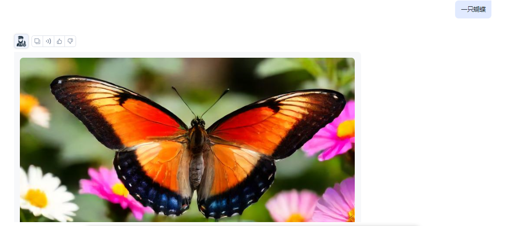

# 😀 项目介绍

<figure><figcaption>
演示图
</figcaption></figure>

* [x] 自动提示词优化（使用ChatGPT3.5）
* [x] 无限制的高清大图生成
* [x] 隐私保护（图片使用localforage实现本地存储）
* [x] 开发者服务（OpenAPI接口或HTML接入）
* [x] 支持自定义api key、base\_url
* [x] 使用美国安全服务器+Let's Encrypt证书加密

