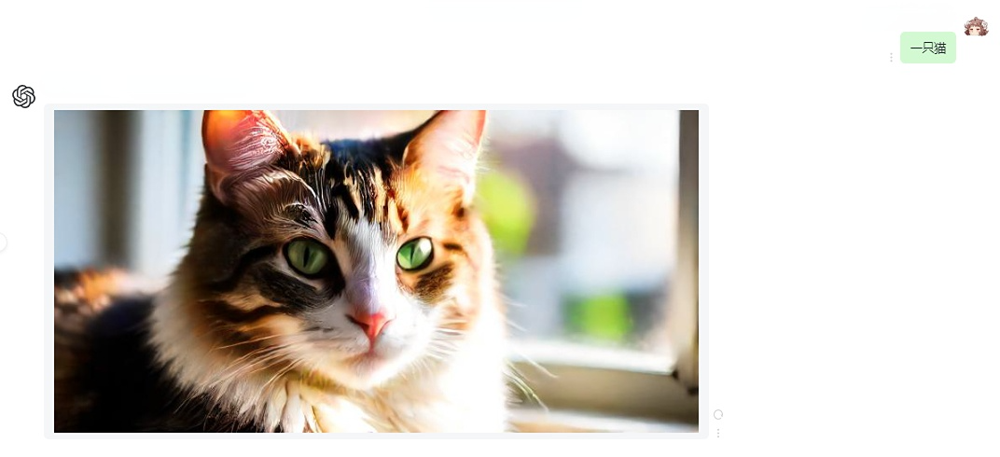

# 😀 项目介绍

<figure><figcaption>
对话截图
</figcaption></figure>

## AI画师支持功能：


<mark style="color:blue;">**好消息，AI画师站点受到cloudflare的保护！**</mark>

* [x] <mark style="color:green;">**浏览器完整性检查**</mark>
* [x] <mark style="color:green;">**自动程序攻击模式**</mark>
* #### <mark style="color:green;">Under Attack模式已激活</mark>


* [x] 无限制的高清大图生成
* [x] 自动提示词AI优化
* [x] 隐私保护（图片使用localforage实现本地存储）
* [x] 使用美国安全服务器+Let's Encrypt证书加密
* [x] 个性化定制（头像、昵称、介绍修改）
* [x] 支持 GPTs 多模态
* [x] 支持即时语音识别(需要浏览器自带语音识别 ASR)&#x20;
* [x] 开发者服务（支持OpenAPI接口和HTML接入，配开发指南）
*

