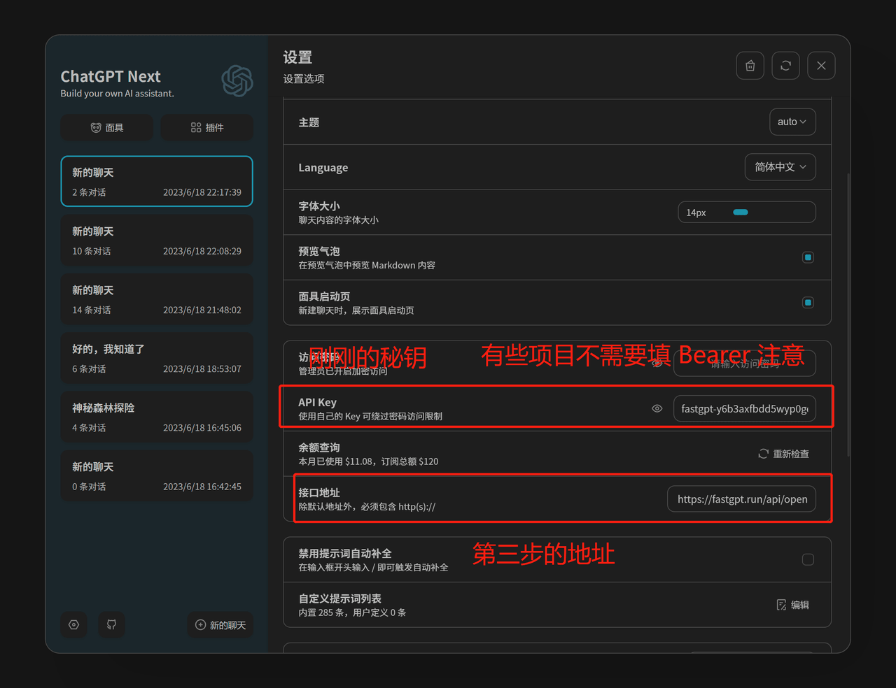
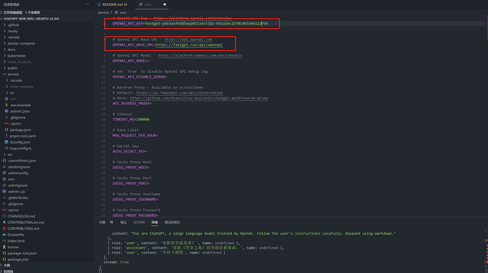

# 💬 对接第三方 GPT 应用

**获取 API 秘钥**&#x20;

请联系客服申请API KEY。


请妥善保存好您的密钥，后台一旦发现违规使用行为将进行安全风控！


**替换三方应用的变量**


```
OPENAI_API_BASE_URL: https://api.fastgpt.in/api (改成自己部署的域名)
OPENAI_API_KEY = 上一步获取到的秘钥
```


[**ChatGPT Next Web**](https://github.com/Yidadaa/ChatGPT-Next-Web) **示例：**

<figure><figcaption></figcaption></figure>

[**ChatGPT Web**](https://github.com/Chanzhaoyu/chatgpt-web) **示例：**

<figure><figcaption></figcaption></figure>
