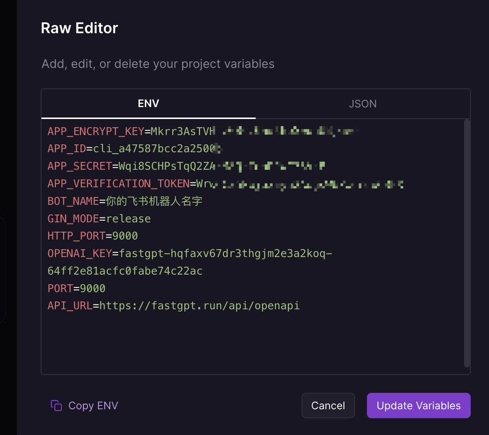

# 📈 接入飞书(社区文章)

### 1. 获取 AI画师 的 OpenAPI API KEY <a href="#id-1-huo-qu-fastgpt-de-openapi-mi-yao" id="id-1-huo-qu-fastgpt-de-openapi-mi-yao"></a>

请联系客服获取API KEY。


[ren-gong-ke-fu.md](../../../ren-gong-ke-fu.md)


### 2. 部署飞书服务 <a href="#id-2-bu-shu-fei-shu-fu-wu" id="id-2-bu-shu-fei-shu-fu-wu"></a>

推荐使用 Railway 一键部署



参考环境变量配置：

<figure><figcaption></figcaption></figure>

AI画师 集成**重点参数：**


```
#上一步FastGPT的OpenAPI 秘钥
OPENAI_KEY=fastgpt-z51pkjqm9nrk03a1rx2funoy
#调用OpenAI的BaseUrl要换成FastGPT的
API_URL=https://api.fastgpt.in/api/openapi
```


### 3. 创建飞书机器人  <a href="#id-3-chuang-jian-fei-shu-ji-qi-ren" id="id-3-chuang-jian-fei-shu-ji-qi-ren"></a>

1. 前往 [开发者平台](https://open.feishu.cn/app?lang=zh-CN) 创建应用 , 并获取到 APPID 和 Secret
2. 前往`应用功能-机器人`, 创建机器人
3. 从 cpolar、serverless 或 Railway 获得公网地址，在飞书机器人后台的 `事件订阅` 板块填写。例如，
   * `http://xxxx.r6.cpolar.top` 为 cpolar 暴露的公网地址
   * `/webhook/event` 为统一的应用路由
   * 最终的回调地址为 `http://xxxx.r6.cpolar.top/webhook/event`
4. 在飞书机器人后台的 `机器人` 板块，填写消息卡片请求网址。例如，
   * `http://xxxx.r6.cpolar.top` 为 cpolar 暴露的公网地址
   * `/webhook/card` 为统一的应用路由
   * 最终的消息卡片请求网址为 `http://xxxx.r6.cpolar.top/webhook/card`
5. 在事件订阅板块，搜索三个词`机器人进群`、 `接收消息`、 `消息已读`, 把他们后面所有的权限全部勾选。 进入权限管理界面，搜索`图片`, 勾选`获取与上传图片或文件资源`。 最终会添加下列回调事件
   * im:resource(获取与上传图片或文件资源)
   * im:message
   * im:message.group\_at\_msg(获取群组中所有消息)
   * im:message.group\_at\_msg:readonly(接收群聊中 @ 机器人消息事件)
   * im:message.p2p\_msg(获取用户发给机器人的单聊消息)
   * im:message.p2p\_msg:readonly(读取用户发给机器人的单聊消息)
   * im:message:send\_as\_bot(获取用户在群组中 @ 机器人的消息)
   * im:chat:readonly(获取群组信息)
   * im:chat(获取与更新群组信息)

### 4. 测试飞书机器人 <a href="#id-4-ce-shi-fei-shu-ji-qi-ren" id="id-4-ce-shi-fei-shu-ji-qi-ren"></a>

私聊机器人，或者群里@它，就可以基于 AI画师 的应用进行回答啦

<figure><figcaption></figcaption></figure>
