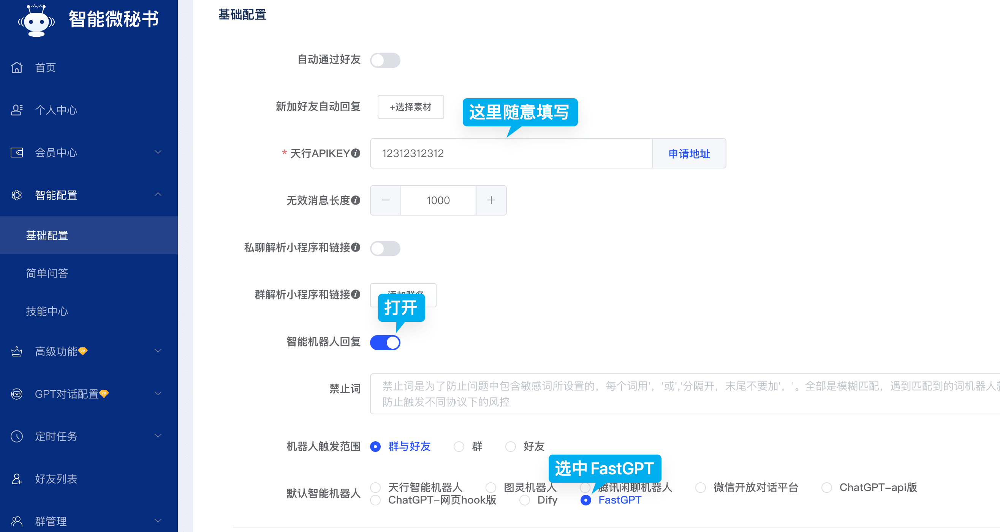
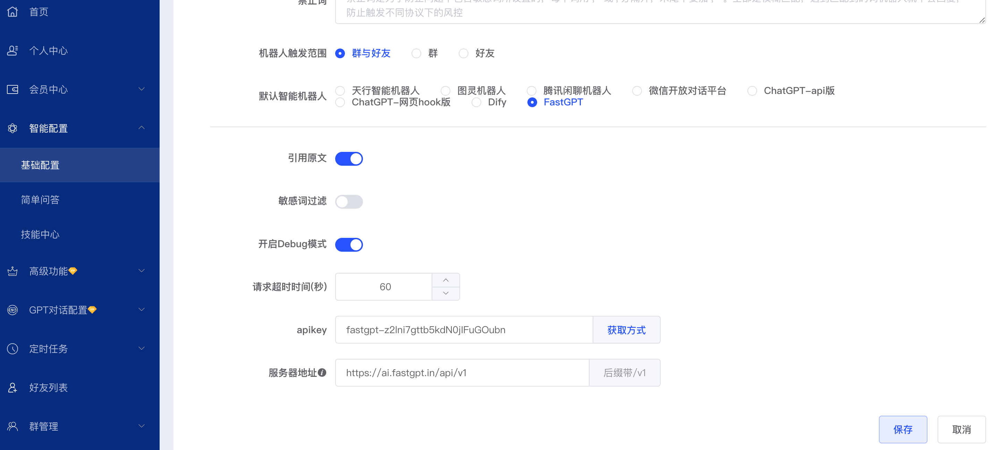
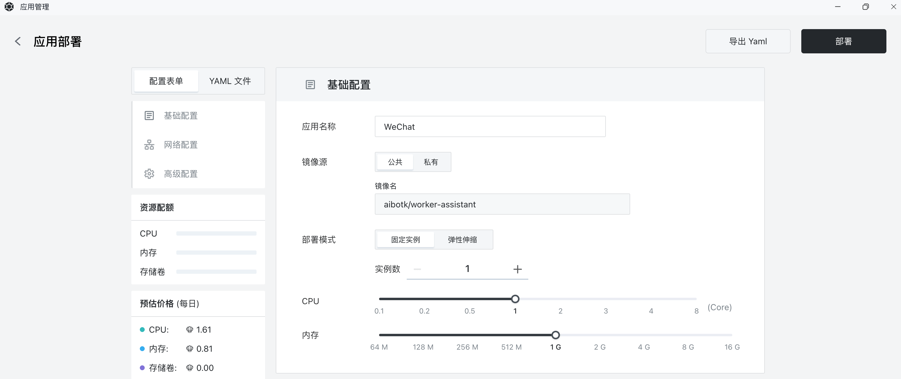
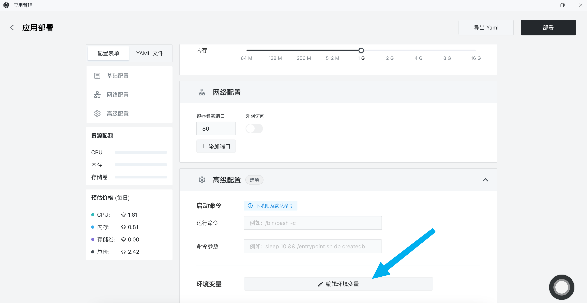
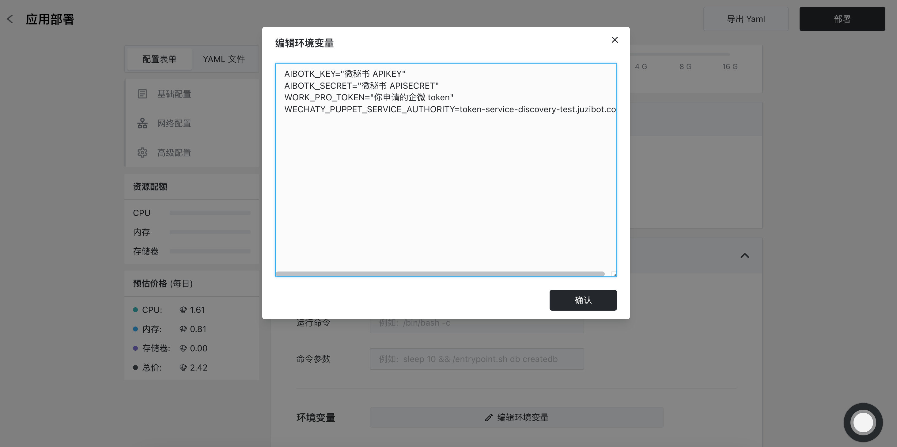
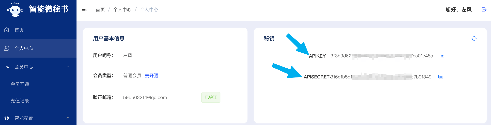
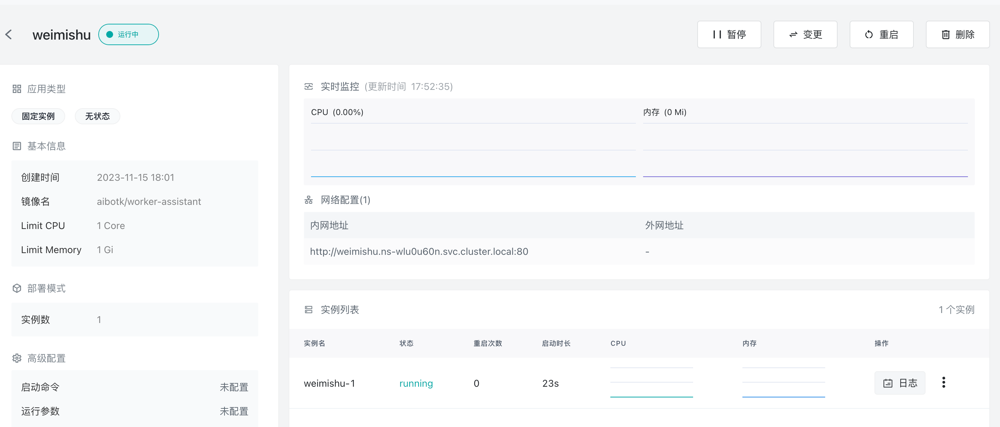
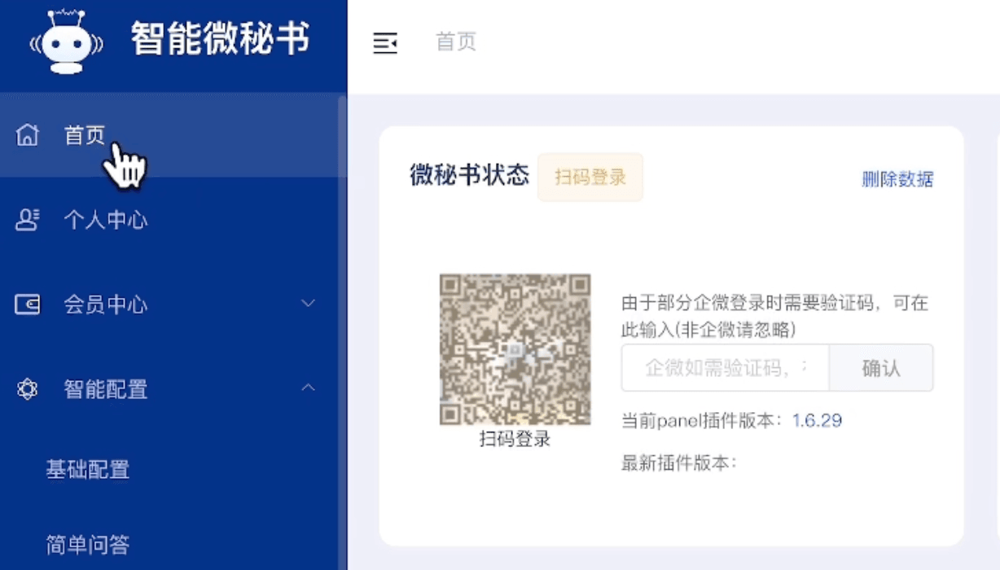
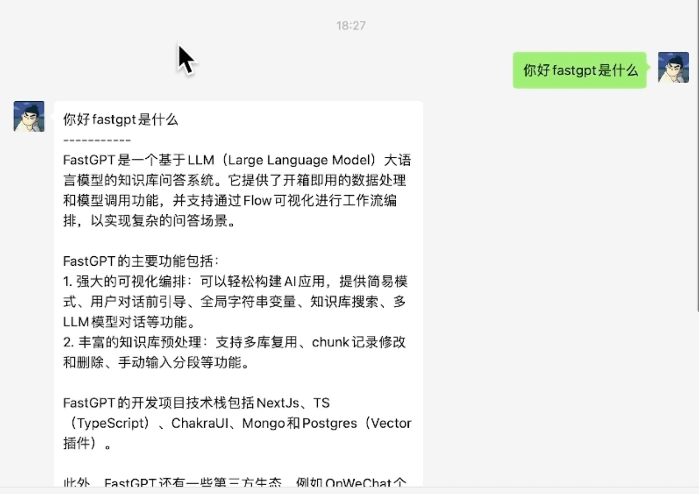

# ☁️ 接入微信和企业微信

**创建API Key**&#x20;

请联系客服获取API KEY。


[ren-gong-ke-fu.md](../../../ren-gong-ke-fu.md)



请妥善保存好您的密钥，后台一旦发现违规使用行为将进行安全风控！



本教程包含第三方服务，AI画师不保证其可用性。


**配置微秘书**&#x20;

打开[微秘书](https://wechat.aibotk.com/?r=zWLnZK) 注册登陆后找到菜单栏「基础配置」->「智能配置」，按照下图配置。

<figure><figcaption></figcaption></figure>

继续往下看到 `apikey` 和`服务器根地址`，这里`apikey`填写我们在 AI画师 的 APIkey，服务器根地址填写官方地址或者私有化部署的地址，这里用官方地址示例，注意要添加`/v1`后缀,填写完毕后保存。

<figure><figcaption></figcaption></figure>

**sealos部署服务**

[访问sealos](https://cloud.sealos.io/) 登陆进来之后打开「应用管理」-> 「新建应用」。

* 应用名：称随便填写
* 镜像名：私人微信填写 aibotk/wechat-assistant 企业微信填写 aibotk/worker-assistant
* cpu和内存建议 1c1g

<figure><figcaption></figcaption></figure>

往下翻页找到「高级配置」-> 「编辑环境变量」

<figure><figcaption></figcaption></figure>

这里需要填写四个环境变量：


```
AIBOTK_KEY=微秘书 APIKEY
AIBOTK_SECRET=微秘书 APISECRET
WORK_PRO_TOKEN=你申请的企微 token   （企业微信需要填写，私人微信不需要）
```


这里最后两个变量只有部署企业微信才需要，私人微信只需要填写前两个即可。

<figure><figcaption></figcaption></figure>

这里环境变量我们介绍下如何填写：

`AIBOTK_KEY` 和 `AIBOTK_SECRET` 我们需要回到[微秘书](https://wechat.aibotk.com/?r=zWLnZK)找到「个人中心」,这里的 APIKEY 对应 AIBOTK\_KEY ，APISECRET 对应 `AIBOTK_SECRET`。

<figure><figcaption></figcaption></figure>

`WORK_PRO_TOKEN` 申请 token 然后填入即可。

`WECHATY_PUPPET_SERVICE_AUTHORITY`的值复制过去就可以。

填写完毕后点右上角「部署」，等待应用状态变为运行中。

<figure><figcaption></figcaption></figure>

返回[微秘书](https://wechat.aibotk.com/?r=zWLnZK) 找到「首页」，扫码登陆需要接入的微信号。

<figure><figcaption></figcaption></figure>

**测试**&#x20;

只需要发送信息，或者拉入群聊@登陆的微信就会回复信息啦。

<figure><figcaption></figcaption></figure>
